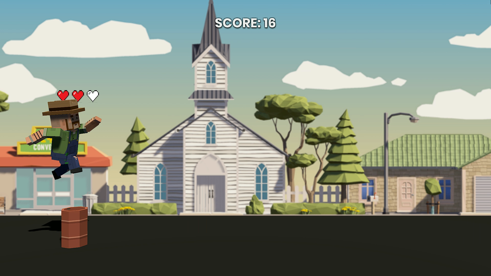
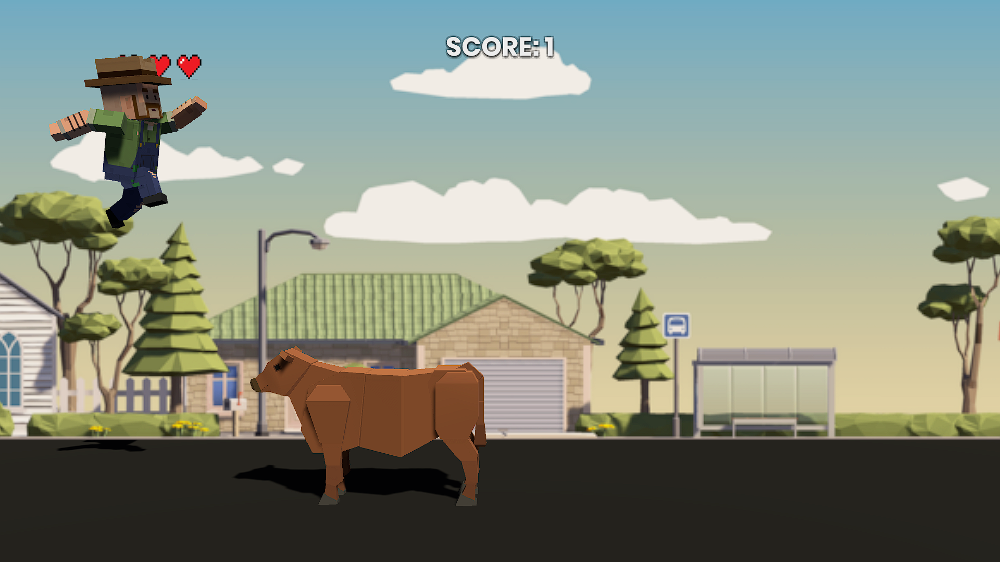
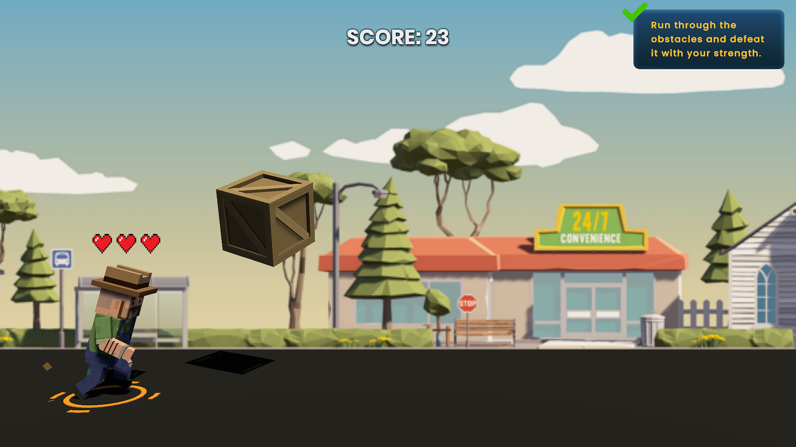
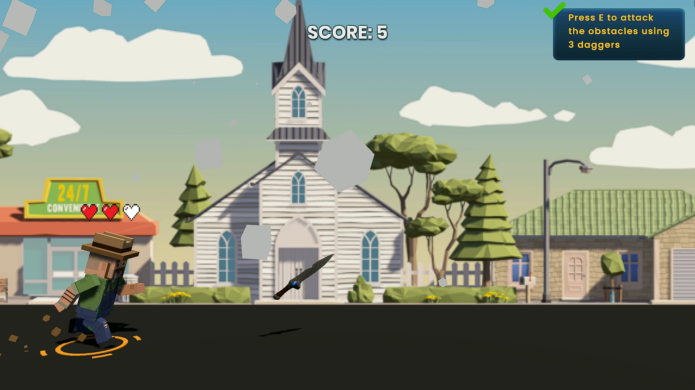
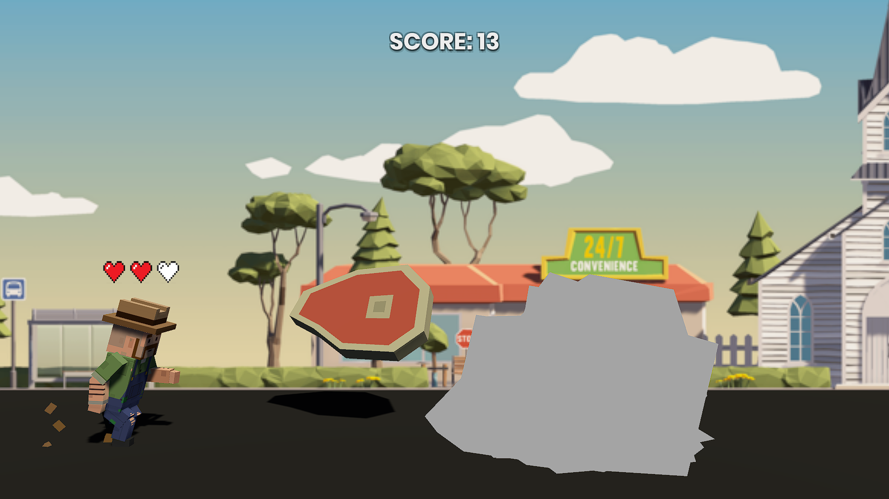
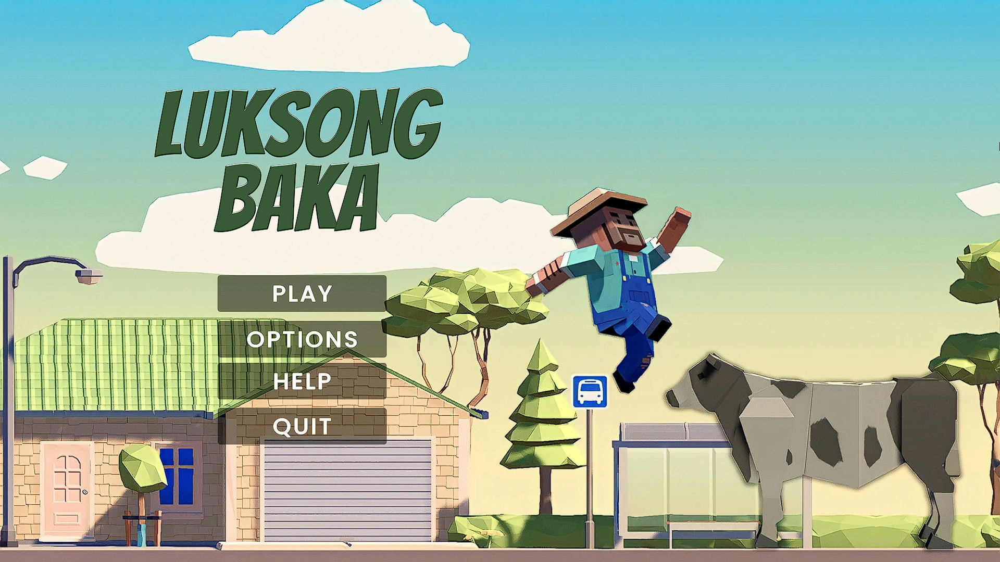

# **Luksong Baka**

#### Description: A 2D side-scrolling game where you guide the farmer to avoid cows and other obstacles to achieve a high score.

#### Submitted as Final Project in the Polytechnic University of the Philippines - Sta. Mesa - A.Y. 2022-2023 in the course CMPE 40032 - Computer Engineering Technology 3 (Game Development).

---

> Luksong Baka

---

### Table of Contents

- [Description](#description)
    - [Technologies](#technologies)
- [How to Use](#how-to-use)
    - [Play in the Web](#play-in-the-web)
    - [Installation](#installation)
- [Gameplay](#gameplay)
  - [Controls](#controls)
    - [Jump](#jump--double-jump)
    - [Dash](#dash)
    - [Throw](#throw-projectiles)
    - [Pause](#pause)
  - [Obstacles](#obstacles)
    - [Type](#type)
    - [Size](#size)
  - [Power-ups](#power-ups)
    - [Strength](#strength)
    - [Bomb](#bomb)
    - [Dagger](#dagger)
  - [Walkable](#walkable)
  - [Lives](#lives)
  - [Scoring](#scoring)
  - [Difficulty](#difficulty)
- [Menus](#menus)
  - [Main Menu](#main-menu)
  - [Pause Menu](#pause-menu)
  - [Game Over Menu](#game-over-menu)
  - [Confirmation Prompt](#confirmation-prompt)
- [Credits and References](#credits-and-references)
- [Authors Info](#authors-info)

---

## Description

It is a 2D side-scrolling game built on [Unity Game Engine version 2021.3.16](https://unity.com/releases/editor/whats-new/2021.3.16). The player controls and assists the farmer to avoid cows and obstacles. The more cows and obstacles avoided, the higher the score. It can be played either online or offline. Playing the game online will be via the web in [itch.io](https://siegfredlorelle.itch.io/luksong-baka). Playing offline requires the user to [install](#installation) the game. Users are not required to log in or give any information to play the game. It is applicable whether the game is played online or offline.

#### Technologies

- Unity Game Engine 2021.3.16
- C# (.NET Standard 2.1)

[Back to the Top](#luksong-baka)

---

## How to Use

#### Play in the Web
 - Access the game via [itch.io](https://siegfredlorelle.itch.io/luksong-baka) (No login required).
 - Click 'Run game'.
 - Enjoy the game!

[Back to the Top](#luksong-baka)

#### Installation

- **Install to Play the Game**

  - On your desktop, download all files in [this Google Drive](https://drive.google.com/drive/folders/1Hg9lJSbEvaov91LZO31yDImckiTCLSwe?usp=sharing). [(Not sure how?)](https://support.google.com/drive/answer/2423534?hl=en&co=GENIE.Platform%3DDesktop)
  - Unzip the files. [(Not sure how?)](https://support.microsoft.com/en-us/windows/zip-and-unzip-files-f6dde0a7-0fec-8294-e1d3-703ed85e7ebc)
  - Open/Launch 'Luksong Baka.exe'.
  - Enjoy the game!

- **Install to Edit the Game**

  - Fork [this repository](https://github.com/SiegfredLorelle/cpe40032-Luksong-Baka-2). [(Not sure how?)](https://docs.github.com/en/get-started/quickstart/fork-a-repo#forking-a-repository)
  - Install [Unity Software](https://learn.unity.com/tutorial/install-unity-software?uv=2021.3&courseId=5cf96c41edbc2a2ca6e8810f&projectId=5d0921d5edbc2a001fca4661#627e6319edbc2a00215e6e72). Note that the [Unity version used is 2021.3.16](https://unity.com/releases/editor/whats-new/2021.3.16).
  - In Unity Hub, open the project ('Luksong Baka' directory) in the forked repository.
  - Feel free to edit the game!

[Back to the Top](#luksong-baka)

---

## Gameplay

- #### **Controls**

  - #### Jump / Double Jump

    **Press space bar** to jump. The player must be on a walkable object (ground and trailers) to jump. The player can only jump in the air once (double jump), and it resets when landing on a walkable object.

    
  - #### Dash

    **Hold Left Shift** to dash. Dash is automatically activated when strength power-up is activated.

  - #### Throw Projectiles

    **Press E** to throw projectiles. Projectiles will only be thrown if a bomb or dagger power-up is activated.

  - #### Pause

    **Press Esc** to pause/unpause the game.

  [Back to the Top](#luksong-baka)

- #### **Obstacles**

  All Obstacles damage the player upon collision by taking one (1) heart.
  
  - #### Type

    - **Cows**

      Cows can turn into meat when hit by a dagger. Turning a cow into meat adds one (1) point to the score (aside from the point added by the dagger hitting the cow).

      

      [Back to the Top](#luksong-baka)

    - **Trucks**

      Trucks have a cab and trailer(s). The cab is considered to be an obstacle (can damage the player). While the trailer is a walkable object.

      

      [Back to the Top](#luksong-baka)

    - **Regular obstacles**

      Regular obstacles do not have unique qualities/mechanics. It includes spools, boxes, and barrels.

      

      [Back to the Top](#luksong-baka)

  - #### Size

    - **Small**

      Due to its, height, small obstacles can be avoided using a single jump.

    - **Large**

      Due to its height, large obstacles are only avoidable using a double jump. There is an audio cue when a large obstacle spawns. Moo sound effects are the audio cue for large cows. Truck horn sound effects are the audio cue for trucks.

      [Back to the Top](#luksong-baka)

- #### **Power-ups**

  A random power-up is activated when a power-up box is picked up. When a power-up is activated, there will be an indicator below the player. The indicator will start blinking when the power-up is about to run out. Only one power-up can be activated at a time due to the power-up box not spawning whilst a power-up is activated.

  - #### **Strength**

    Makes the player invincible. Obstacles that collided with the player will be thrown into the air. Throwing an obstacle will add one (1) point to the score (the same score as avoiding it). Dash is automatically activated and will last until the indicator starts blinking. The total duration of the strength power-up is 5 seconds.

    

    [Back to the Top](#luksong-baka)

  - #### **Bomb**

    Allows the player to throw unlimited bombs. A bomb is thrown when the E key is pressed. Bombs that collide with obstacles will create an explosion and add one (1) point to the score (same as avoiding it). The total duration of the bomb power-up is 5 seconds.

    

    [Back to the Top](#luksong-baka)

  - #### **Dagger**

    Allows the player to throw five (5) daggers. A dagger is thrown when the E key is pressed. Daggers that collide with cows will turn the cow into meat, and add two (2) points to score. Daggers that collide with trucks or regular obstacles will destroy the obstacle and add one (1) point to the score (same score as avoiding it). The dagger power-up lasts until all five (5) daggers are thrown. It does not have a duration.

    

    

    [Back to the Top](#luksong-baka)

- #### **Walkable**

  The player landing on a walkable object resets double jump. There are two walkable objects in the game:

  - Ground
  - Truck Trailer

  

  [Back to the Top](#luksong-baka)

- #### **Lives**

  The number of lives is indicated by the number of full hearts on top of the player. The player can only have a maximum of three (3) lives. The game starts with three (3) lives. The number of lives is reduced by one (1) when taking damage (colliding with obstacles). The number of lives can increase by one (1) when a floating heart (similar to a power-up box) is picked up. The game is over when the player has no more lives left.

  

  [Back to the Top](#luksong-baka)

- #### **Scoring**

  Events that add one (1) point to score:
  - avoiding an obstacle
  - throw obstacle into the air (via strength power-up)
  - obstacle destroyed by an explosion (bomb-obstacle collision)
  - obstacle destroyed by a dagger (dagger-obstacle collision)

  Events that add two (2) points to score:
  - dashing to avoid obstacles
  - turning cow to meat (dagger-cow collision)

  Events that reduced three (3) points to score:
  - player hitting obstacles (player-obstacle collision)

  [Back to the Top](#luksong-baka)

- #### **Difficulty**

  The game gets more difficult as the score increases. As the score increase by five (5), the spawn interval of obstacles decreases. Lower spawn interval results in more obstacles and less space for the player to land on the ground. The lowest spawn interval happens when the score is at forty (40). Any score higher than forty (40) will still have the lowest spawn interval possible.

  [Back to the Top](#luksong-baka)

---

## Menus

- #### **Main Menu**

  The player/user is redirected to the Main Menu upon starting/launching the game.

  

  Main Menu has 4 available options/buttons:

  - **Play**

    Redirects the player to the game itself. Unloads Main Menu Scene and loads Luksong Baka Scene.

    [Back to the Top](#luksong-baka)

  - **Options**

    Allows the player/user to adjust the volume of background music and sound effects of the game. Hide/deactivate buttons in the Main Menu and show/activate buttons in the options canvas.

    

    [Back to the Top](#luksong-baka)

  - **Help**

    Shows the controls and power-ups in the game. Loads Help Scene additively to Main Menu Scene.

    

    [Back to the Top](#luksong-baka)

  - **Quit**

    Prompt the player/user if they really want to exit the game. Exits the game if yes. If no, redirect back to the Main Menu. Show/activates Confirmation Prompt Canvas.

    [Back to the Top](#luksong-baka)

- #### **Pause Menu**

  Pause Menu is shown/activated when pressing the Esc key while unpaused.

  Pause Menu has 4 available options/buttons:

  - **Restart**

    Restarts the game. Score, difficulty, and lives are reset to their default/starting values. All power-ups are deactivated. Reloads the Luksong Baka Scene.

  - **Help**

    Shows the controls and power-ups in the game. Loads Help Scene additively to Main Menu Scene.

  - **Quit**

    Prompt the player/user if they really want to exit the game. Exits the game and redirects to the Main Menu if yes. Go back to the Pause Menu if no. Show/activates Confirmation Prompt Canvas.

  - **Resume**

    Unpause the game. Same as pressing the Esc key while paused.

  

  [Back to the Top](#luksong-baka)

- #### **Game Over Menu**

  The Game Over Menu is shown/activated when the player has zero (0) lives. It shows the final score achieved in that session of the game.

  Game Over Menu has 2 available options/buttons:

  - **Restart**

    Restarts the game. Score, difficulty, and lives are reset to their default/starting values. Reloads the Luksong Baka Scene.

  - **Quit**

    Prompt the player/user if they really want to exit the game. Exits the game and redirects to the Main Menu if yes. If no, go back to the Game Over Menu. Show/activates Confirmation Prompt Canvas.

  

  [Back to the Top](#luksong-baka)

- #### **Confirmation Prompt**

  Prompts player/user if they really want to exit the game. A Confirmation Prompt is activated when pressing any quit or exit buttons. Quit buttons from the Pause Menu and the Game Over Menu will redirect to the Main Menu if choosing yes. Choosing no will redirect back to the Pause Menu or the Game Over Menu. The exit button from the Main Menu will exit/close the game itself (Luksong Baka.exe) if choosing yes. Choosing no will deactivate the Confirmation Prompt and redirect back to the Main Menu.

  

  [Back to the Top](#luksong-baka)

---

## Credits and References

Assets, prefabs, images, sound effects, and background music are owned by their rightful owner.

- Inspiration from [Prototype 3 of Create with Code - Unity Course](https://learn.unity.com/project/unit-3-sound-and-effects?uv=2020.3&courseId=5cf96c41edbc2a2ca6e8810f)
- Assets from [Create with Code - Unity Course](https://learn.unity.com/course/create-with-code?uv=2020.3)
- Dagger Prefab from [Unity Asset Store by SICS Games](https://assetstore.unity.com/packages/3d/props/weapons/low-poly-weapons-71680)
- Trucks Prefab from [Unity Asset Store by VIS Games](https://assetstore.unity.com/packages/3d/vehicles/land/single-detailed-truck-895)
- UI Assets [Unity Asset Store by Cyberlogical](https://assetstore.unity.com/packages/tools/gui/pause-button-kit-67203)
- Buttons and Fonts from [Unity Asset Store by That Witch Design](https://assetstore.unity.com/packages/2d/gui/icons/simple-button-set-02-184903)
- Heart Image from [Vecteezy by drsuthee915755](https://www.vecteezy.com/vector-art/11411850-pixel-heart-set-icon-on-white-background-red-heart-pixel-logo-8-bit-health-heart-sign-vintage-love-symbol-flat-style)
- Background Music from [Pokemon Ruby/Sapphire/Emerald - Dewford Town Theme in Youtube](https://www.youtube.com/watch?v=DmXZrDLnaiE)
- Moo Sound Effects 1 from [Minecraft - Cow Sound Effects in Youtube](https://www.youtube.com/watch?v=7r8x0YLlarc)
- Moo Sound Effects 2 from [Minecraft - Cow Sound Effects in Youtube](https://www.youtube.com/watch?v=CnDqh7yrgsM)
- Damage Sound Effects from [Minecraft - Damage Sound Effects in Youtube](https://www.youtube.com/watch?v=0T_NR2KY8uI)
- Explosion Sound Effects from [Minecraft - TNT Explosion in Youtube](https://www.youtube.com/watch?v=tUlthCngK9U)
- Truck Horn Sound Effects from [Pixabay by hsaunier10](https://pixabay.com/sound-effects/car-horn-beepsmp3-14659/)
- Jump Sound Effects from [Pixabay by Bastianhallo](https://pixabay.com/sound-effects/cartoon-jump-6462/)
- Metal Sound Effects (dagger destroying obstacles) from [Fesliyan Studios](https://www.fesliyanstudios.com/play-mp3/2431) 

[Back to the Top](#luksong-baka)

---

## Authors Info
- Github - [Siegfred Lorelle Mina](https://github.com/SiegfredLorelle)
- Github - [Shin Lim](https://github.com/ShinayLim) & [Shin Lim](https://github.com/shinlim12)
- Github - [Edgar Esguerra Jr.](https://github.com/edgarpesguerrajr)
- Github - [Kenji Ilao](https://github.com/KenjiIlao)

[Back to the Top](#luksong-baka)